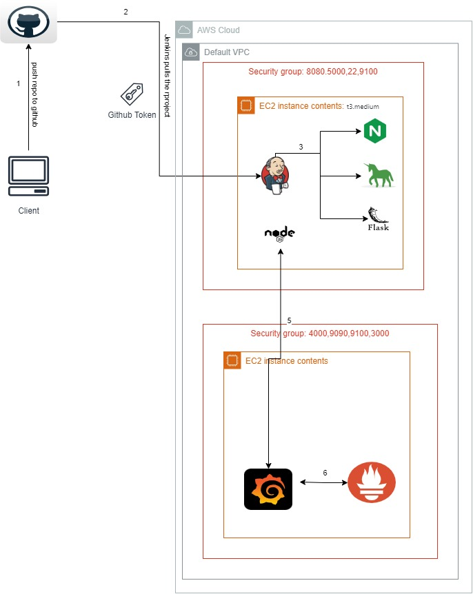

# Kura Labs Cohort 5- Deployment Workload 3
---
## Monitoring Application and Server Resources

## Table Of Contents

- [PURPOSE](#purpose)
- [STEPS And Why each was Necessary](#the-steps-taken-and-why-each-was-necessaryimportant)
- [SYSTEM DESIGN DIAGRAM](#system-design-diagram)
- [ISSUES and TROUBLESHOOTING](#issuestroubleshooting)
- [OPTIMIZATION](#optimization)
- [CONCLUSION](#conclusion)


### PURPOSE

The purpose of this project to automate the deployment of an application using Jenkins(CI/CD) and monitor the application using monitoring tools like Prometheus and Grafana.

### The "STEPS" taken (and why each was necessary/important)

1. We create a new repo called "microblog_EC2_deployment" to store our code and have version control.

2. We create Ubuntu EC2 instance (t3.medium) named "Jenkins" and install Jenkins onto it  We create security group for SSH and HTTP traffic in addition to the ports required for Jenkins and any other services needed.


```
sudo apt update && sudo apt install fontconfig openjdk-17-jre software-properties-common && sudo add-apt-repository ppa:deadsnakes/ppa && sudo apt install python3.7 python3.7-venv

echo "deb [signed-by=/usr/share/keyrings/jenkins-keyring.asc]" https://pkg.jenkins.io/debian-stable binary/ | sudo tee /etc/apt/sources.list.d/jenkins.list > /dev/null
sudo apt-get update
sudo apt-get install jenkins
sudo systemctl start jenkins
sudo systemctl status jenkins

```

3. Configure the server by installing 'python3.9',  'python3.9-venv', 'python3-pip', and 'nginx'

```
sudo apt install python3.9 python3.9-venv python3-pip nginx
```

4. Clone your GH repository to the server, cd into the directory, create and activate a python virtual environment with: 

```
$python3.9 -m venv venv
$source venv/bin/activate
```

5. While in the python virtual environment, install the application dependencies and other packages by running:

```
$pip install -r requirements.txt
$pip install gunicorn pymysql cryptography
```

6. Set the ENVIRONMENTAL Variable:

```
FLASK_APP=microblog.py
```

This is used to set the environment variable FLASK_APP to the value microblog.py. This tells Flask which application to run when executing Flask commands, such as flask run.

7. Run the following commands: 

```
$flask translate compile
$flask db upgrade
```

8. Edit the NginX configuration file at "/etc/nginx/sites-enabled/default" so that "location" reads as below.

```
location / {
proxy_pass http://127.0.0.1:5000;
proxy_set_header Host $host;
proxy_set_header X-Forwarded-For $proxy_add_x_forwarded_for;
}
```
Question: What is this config file/NginX responsible for?
This Nginx configuration sets up Nginx to act as a reverse proxy, forwarding requests to a backend service running on port 5000 and preserving important request headers

9. Run the following command and then put the servers public IP address into the browser address bar

```
gunicorn -b :5000 -w 4 microblog:app
```


Question: What is this command doing? You should be able to see the application running in the browser but what is happening "behind the scenes" when the IP address is put into the browser address bar?

- The command starts a Gunicorn server that listens on port 5000 and uses 4 workers to handle requests.

- When we enter the server's public IP address into a browser, the browser sends a request to the server's IP address on port 5000.

- Gunicorn receives this request, processes it using the application defined in microblog.py, and sends the response back to the browser.

10. If all of the above works, stop the application by pressing ctrl+c.  Now it's time to automate the pipeline.  Modify the Jenkinsfile and fill in the commands for the build and deploy stages.

  a. The build stage should include all of the commands required to prepare the environment for the application.  This includes creating the virtual environment and installing all the dependencies, setting variables, and setting up the databases.

  ```
        stage ('Build') {
            steps {
                sh '''#!/bin/bash
                python3.9 -m venv venv
                source venv/bin/activate
                pip install pip --upgrade
                pip install -r requirements.txt
                pip install gunicorn pymysql cryptography 
                export FLASK_APP=microblog.py
                flask translate compile
                flask db upgrade
                '''
            }
```

  b. The test stage will run pytest.  Create a python script called test_app.py to run a unit test of the application source code. IMPORTANT: Put the script in a directory called "tests/unit/" of the GitHub repository.
    
```
          stage ('Test') {
            steps {
                sh '''#!/bin/bash
                source venv/bin/activate
                py.test ./tests/unit/ --verbose --junit-xml test-reports/results.xml
                '''
            }

```

  c. The deploy stage will run the commands required to deploy the application so that it is available to the internet. 

```
        stage ('Deploy') {
        steps {
            sh '''#!/bin/bash

            source venv/bin/activate
            echo "Starting Gunicorn..."
            gunicorn -b :5000 -w 4 --daemon microblog:app
            '''
        }
        }

```

  d. There is also a 'clean' and an 'WASP FS SCAN' stage.  What are these for?
        Clean stage checks if any gunicorn is running and terminates it, so we can deploy it during the deploy stage.
        OWASP FS SCAN : Scans project dependencies to look for any vulnerability and publish the result of the scan


  
11. In Jenkins, install the "OWASP Dependency-Check" plug-in

    a. Navigate to "Manage Jenkins" > "Plugins" > "Available plugins" > Search and install

 	b. Then configure it by navigating to "Manage Jenkins" > "Tools" > "Add Dependency-Check > Name: "DP-Check" > check "install automatically" > Add Installer: "Install from github.com"

Question: What is this plugin for?  What is it doing?  When does it do it?  Why is it important?

This plugin is to scan the dependencies of our program. It runs during our Jenkins pipeline. It is important to keep our project secure and to make sure the vulnerabilites are not deployed to production.


12. Create a MultiBranch Pipeline and run the build.  IMPORTANT: Make sure the name of the pipeline is: "workload_3".

    Note: Did the pipeline complete? Is the application running?

    Hint: if the pipeline stage is unable to complete because the process is running, perhaps the process should be run in the BACKGROUND (daemon).
    
    Hint pt 2: NOW does the pipeline complete? Is the application running?  If not: What happened to that RUNNING PROCESS after the deploy STAGE COMPLETES? (stayAlive)


  

14. After the application has successfully deployed, create another EC2 (t3.micro) called "Monitoring".  Install Prometheus and Grafana and configure it to monitor the activity on the server running the application. 

We create Grafana to pull data from prometheus. And we install node exporter in the first EC2(Jenkins) to collect data.


### "SYSTEM DESIGN DIAGRAM"




### "ISSUES/TROUBLESHOOTING"

One issue I encountered was in the initial build stage, the pipeline kept on failing with permission denied error message. I tried to double check my github tokens. Later I used the .gitignore to avoid all virtual env files to be pushed to github and it finally passed through the build stage.

Another issue was during the deploy stage, the pipeline would not stop automatically because gunicorn was still running. I tried adding daemon to the command, which ended the pipeline but the gunicorn also stopped running with the pipeline. For this issue, I had to run gunicorn as a separate service and use jenkins to restart gunicorn after every deployment.

While running gunicorn as a separate service, I added the wrong path, and when I added different permissions to Jenkins, it completely broke all the permissions in my EC2. I had to restart a new EC2 as I was unable to resolve this issue.

### "OPTIMIZATION"

  - We can try to implement autoscaling so our instance dont run out of resource
  - We could use load balancer for heavy traffic.
  - I could use script to automate Jenkins and other installations.
  - We could use NVD API Key to make sure the pipeline runs faster

### "CONCLUSION"

Through this workload we are able to automate deployment of a Flask application using Jenkins.


